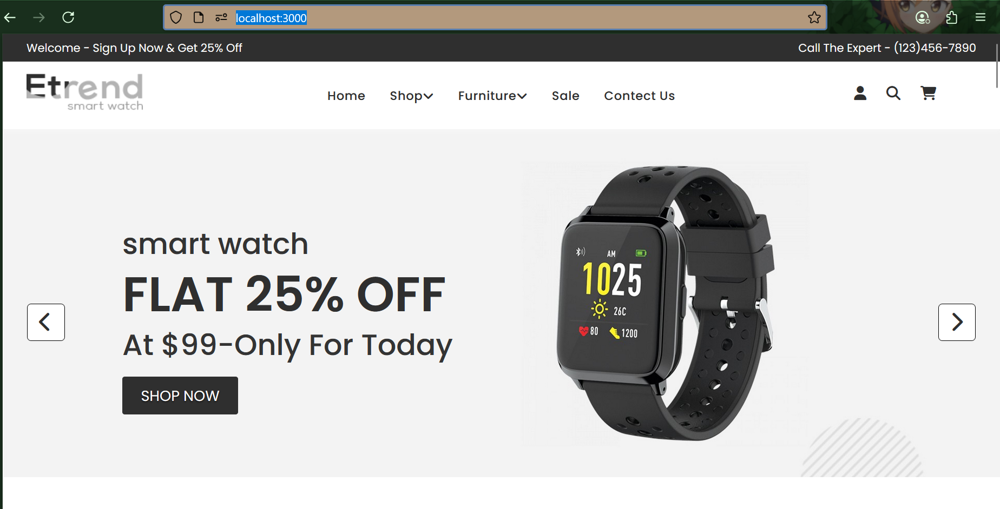

# ⌚ Smart Watch Website (React.js)

A modern and responsive **Smart Watch Website** built using React.js.  
Includes stylish UI with Font Awesome icons, and custom fonts.

---

## Demo:


---
## 🚀 Features

- Product showcase with images & pricing
- Responsive design using CSS
- Font Awesome icons
- React Router for page navigation
- Google Fonts integration
---

## 🛠️ Tech Stack
- React.js
- React Router DOM
- Font Awesome
- Google Fonts
- Responsive Design

---
## 📦 Installation & Commands
### ✅ Required Packages
Install the following packages after creating the React app:

```bash
npm install react-router-dom
npm install @fortawesome/fontawesome-free
```
---

 ### 📁 Project Structure
 ```
react-js-practice/
├── node_module
├── public/
│ └── index.html
├── src/
│ └── CSS/
│ ├── Style.css
│ ├── Men.css
│ └── ...more files..
| ── Body/..
| ── Smart_Contect/..
| ── Smart-Men/..
| ── Body.jsx
| ── Footer.jsx
| ── Header.jsx
| ── House.jsx
│ ├── index.js
├── package-lock.json
├── package.json
├── README.md
```

## ⚙️ How to Run This Code
Anyone can run this project by following these simple steps:

### ✅ Step 1: Install React App (Base Project)
Open terminal or CMD and run:
```bash
npx create-react-app Website
```

This will automatically create the following folders and files :
```
react-js-practice/
├── node_modules/         # All required dependencies
├── package.json          # Project configuration and dependencies
├── package-lock.json     # Exact version lock for dependencies
├── public/               # Contains index.html and other static files
└── src/                  # Your React source code (App.js, index.js, etc.)
```

### ✅ Step 2: Add My Code
After creating the base React app, follow these steps to use the practice files from this repository:

1. **Clone or download** this GitHub repository.
2. **Copy all folders** (like `CSS/`, `Smart-Men/`, etc.) into your local React app's `src/` folder.

### ✅ Step 3: Run the React App
Now start the React development server by running:
```bash
npm start
```
This will open your app automatically in the browser at:
``` http://localhost:3000 ```

---
## 🧾 Requirements

- ✅ Node.js installed  
- ✅ Internet connection to install packages  
- ✅ Code editor (like VS Code)

---
## 📬 Connect with Me

If you find this useful or want to collaborate, feel free to connect:

- 🌐 GitHub: https://github.com/ishikalimbasiya005
- 💼 LinkedIn: www.linkedin.com/in/ishikalimbasiya

---

Thanks for visiting my repository! 😊  
Keep learning and styling! 💻🎨


